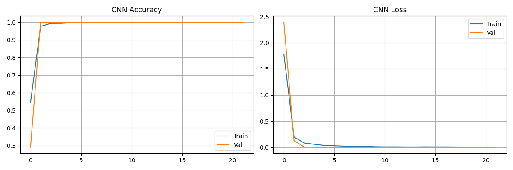
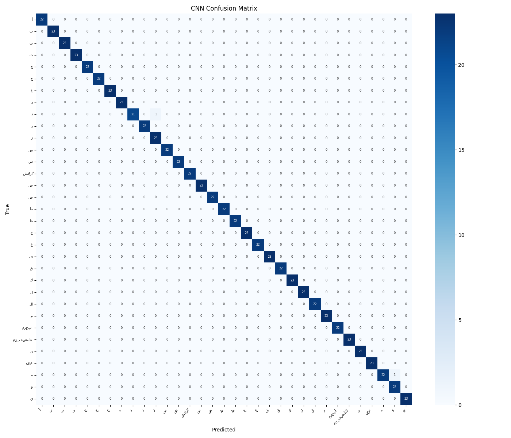
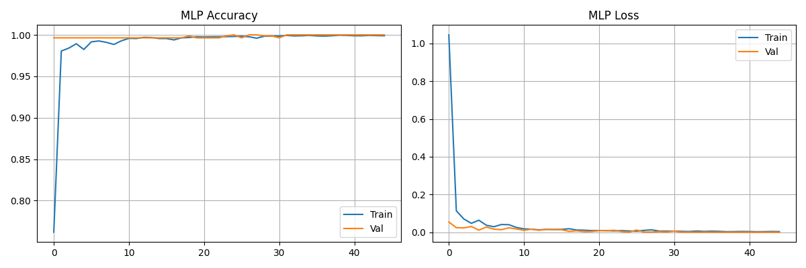
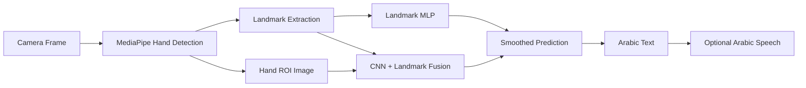

# Arabic Sign Recognition Sensor Glove

<p align="center">
  <strong>Assistive AI for real-time Arabic hand-gesture recognition</strong>
</p>

<p align="center">
  
  
  
  
  <a href="https://github.com/shaiksadik1725-droid/arabic-sensor-Glove/actions/workflows/python-syntax.yml"></a>
</p>

## Project at a Glance

| Item | Details |
|---|---|
| Domain | Assistive computing / computer vision |
| Input | Camera-based hand gestures |
| Feature representation | MediaPipe landmarks + image features |
| Models | Landmark MLP and CNN + landmark fusion |
| Output | Arabic label with optional speech |
| Status | Academic prototype |

## Overview

This project captures hand gestures, extracts hand landmarks, trains classification models, and performs real-time prediction. It also includes Arabic text rendering, prediction smoothing, and optional Arabic text-to-speech.

## Training Evidence

<p align="center">
  
  
</p>

<p align="center">
  
  
</p>

## Recognition Pipeline



## Main Features

- Real-time hand detection
- Landmark-based gesture representation
- CNN + landmark feature fusion
- MLP landmark classifier
- Arabic text rendering
- Temporal smoothing for stable predictions
- Optional Arabic speech output
- Dataset collection and training scripts

## Technology Stack

- Python
- OpenCV
- MediaPipe
- TensorFlow / Keras
- NumPy
- scikit-learn
- Pillow
- Matplotlib / Seaborn

## Repository Structure

```text
arabic-sensor-Glove/
├── README.md
├── requirements.txt
└── gesture/
    ├── collect_data.py
    ├── train.py
    ├── predict.py
    ├── arabic_sign_dataset/
    ├── models/
    └── Arabic_SensorGlove/
```

## Setup

```bash
git clone https://github.com/shaiksadik1725-droid/arabic-sensor-Glove.git
cd arabic-sensor-Glove
pip install -r requirements.txt
cd gesture
python train.py
```

Run real-time recognition:

```bash
python predict.py
```

## Accessibility Goal

The project explores how computer vision can translate recognized hand gestures into readable Arabic text and, when configured, spoken Arabic output.

## Future Work

- Expand the Arabic sign vocabulary
- Increase dataset diversity
- Improve lighting and background robustness
- Add physical glove-sensor fusion
- Benchmark Raspberry Pi / edge performance
- Add a mobile or web interface

## Author

**Sadik Shaik**

Computer Engineering · Artificial Intelligence · Embedded Systems
